class: inverse, center, middle


#### Coding is a core part of scientific education!

> "Not only is coding a core skill that gets the basic work of biology done, it's also taught [students] to look at problems in new ways." 

> "Every day, biologists go into the lab to coax data out of living matter—more and more data, with the advent of [new] biological tools …To analyze it all, biologists need to write programs specifically tailored for their experiments." <footer>— [Want to Make It as a Biologist? Better Learn to Code](https://www.wired.com/2017/03/biologists-teaching-code-survive/#:~:text=Not%20only%20is%20coding%20a,at%20problems%20in%20new%20ways.&text=As%20tools%20evolve%20to%20allow,core%20part%20of%20scientific%20education.)</footer>


<style type="text/css">
.remark-slide-content {
    font-size: 25px;
    padding: 1em 4em 1em 4em;
}
</style>


---

class: inverse, center, middle

# `R` as the engine, `RStudio` as the dashboard


---
class: inverse, center, middle

# `R` as Tairneanach, `RStudio` as Violet's saddle

<div class="figure">

<p class="caption">plot of chunk unnamed-chunk-1</p>
</div>


.footnote[[source](https://www.instagram.com/sampaiarts/p/Cu7FfCvLtBZ/)]
---


## Before Friday's lecture!!


**Install `R` and `RStudio`** 

1.) Instructions in the [Module 1 coursebook](https://biosci220.github.io/BIOSCI220/)

2.) [😎 How to R 😎, CANVAS page](https://canvas.auckland.ac.nz/courses/120365/pages/how-to-r)

3.) **Help sessions** in 106-014
 
   + **Tuesday** 11.30pm to 1pm
   + **Thursday** 3.30pm to 5pm

---
class: inverse

### 🎨  a`R`t challenge

+ Get `R` and `RStudio` up and running on your computer
+ Create your own a`R`t!
+ Post your a`R`t to [this CANVAS discussion](https://canvas.auckland.ac.nz/courses/120365/discussion_topics/1443319) (before next Tuesday's lecture)


``` r
## devtools::install_github("djnavarro/turmite59")
turmite59::turmite59("blue")
```


<center></center>

.footnote[*[maybe some extra hints if you come along to a drop-in session…]*]

---
class: inverse

### 🐉  dragon challenge

<div align=center>
<p><a href="https://dub.sh/biosci220" target="_blank">dub.sh/biosci220</a></p>

</div>

Let me know (<a href="mailto:c.jonestodd@auckland.ac.nz">c.jonestodd@auckland.ac.nz</a>) when you've won!

---
class: rolling-slide

###   Week 01, lecture 02


<div class="rolling-container">
  <div class="rolling-content">
  <p>🌼 <strong>Personal support</strong></p>
    <p><a href="https://www.auckland.ac.nz/en/students/student-support/personal-support/te-papa-manaaki-campus-care.html" target="_blank">Te Papa Manaaki | Campus Care</a></p>
    <p>📢 <strong>Class rep?</strong></p>
    <p> <a href="mailto:jenn.jury@auckland.ac.nz">Email Jenn Jury</a></p>
    <p>🎨 <strong>a`R`t challenge</strong></p>
    <p>Post your a`R`t to<a href="https://canvas.auckland.ac.nz/courses/120365/discussion_topics/1443319" target="_blank">this CANVAS discussion</a></p>
    
     <p>📖 <strong>Courseguide</strong></p>
    <p><a href="https://biosci220.github.io/BIOSCI220/" target="_blank">Chapter 1</a></p>
    <p>💬 <strong>My consultation hours</strong></p>
    <p>Mondays & Tuesdays 1—2pm, <a href="https://maps.auckland.ac.nz/wayfinding?type=poi&selectedLocation=1000028551" target="_blank">blg 303 rm 318</a></p>
    <p>💡  <strong>Lecture Activities</strong></p>
    <p><a href="https://dub.sh/biosci220" target="_blank">dub.sh/biosci220</a></p>
    
  </div>
</div>

---

class: inverse

### 🎨  a`R`t challenge so far

<div align=center>
<p><a href="https://dub.sh/biosci220" target="_blank">dub.sh/biosci220</a></p>

</div>

---
class: inverse, middle, center


> There were multiple times where I poured in hours to try to get the code to work and essentially went around in circles achieving nothing, only to come back to the same problem a few hours later or the
next day and getting it to run almost instantly. I gradually learned that once I start to find myself banging my head against the wall on the same problem for too long it’s better to let it simmer and come back to it later! <footer>— Student reflection</footer>


---


.small[
### Learning objectives

+ **Define** the difference between `R` and `RStudio`
+ **Discuss** the benefits and issues associated with these software being used in the scientific community
+ **Distinguish** between different data types (e.g., integers, characters, logical, numerical)
+ **Explain** what an `R` function is; **describe** what an argument to an `R` function is
+ **Explain** what an `R` package is; **distinguish** between the functions `install.packages()` and `library()`
]

---


.small[
### Learning objectives
+ **Explain** what a *working directory* is in the context of `R`
+ **Use** the appropriate `R` function to read in a `.csv` data
+ **Interpret** and **fix** basic  `R` errors
+ **Define** different data types in the context of `R` 
+ **Carry out** basic exploratory data analysis using `tidyverse` (e.g., use the pipe operator, `%>%` when summarising a `data.frame`)
]


---


## Why `R`? 

--
+ Free

--
+ Open source

--
+ Huge online support network

--
+ Flexible; if you can code it you can do it!

--
+ Everybody's doing it...

   + [Why You Should Become a UseR](https://www.psychologicalscience.org/observer/why-you-should-become-a-user-a-brief-introduction-to-r#:~:text=R%20is%20a%20programming%20language,of%20statistics%20and%20research%20methods.&text=Programming%20languages%20can%20be%20intimidating.)
   + [Powerful Benefits of Using R to Analyze Your Research Data ](https://learning.edanz.com/powerful-benefits-of-using-r-to-analyze-your-research-data-and-a-few-limitations/)
   + [Why R?](https://datacarpentry.org/semester-biology/about/why-r/)
   + [The mismatch between current statistical practice and doctoral training in ecology](https://esajournals.onlinelibrary.wiley.com/doi/full/10.1002/ecs2.1394)


---


## Why `RStudio`? 

--
+ Works **really** nicely with `R`

--
+ Huge online support network

--
+ Flexible; so, so, many tools and additions!

--
+ Everybody's doing it...

  + [What Makes RStudio Different?](https://www.rstudio.com/about/what-makes-rstudio-different)
  + [The Advantages of RStudio](https://www.theanalysisfactor.com/the-advantages-of-rstudio/)
  + [Top 6 reasons you need to be using RStudio](https://www.r-bloggers.com/2013/02/top-6-reasons-you-need-to-be-using-rstudio/)


---
class: inverse, center, middle

#### `RStudio` 

<div align=center>
<p><a href="https://dub.sh/biosci220" target="_blank">dub.sh/biosci220</a></p>

</div>


---
class: inverse, center, middle

#### `RStudio` navigation [live demo]


---
class: inverse, center, middle

#### `R` code


``` r
plot(1:10, 10:1,  col = c("red", "green"), pch = 12)
```

<div align=center>
<p><a href="https://dub.sh/biosci220" target="_blank">dub.sh/biosci220</a></p>

</div>


---


## Terminology

+ **functions**: `R` commands that tell your computer what to do
--

+ **arguments**: inputs we give to **functions** that are used by that **function** to give some output
--

+ **packages**: a collection of specific **functions**
--

+ **running** code: the act of telling R to perform an act by giving it commands in the console
--

+ **objects**: what values are stored in
--

+ **script**: a text file containing a set of commands and comments
--

+ **comments**: notes written within a **script** to better document/explain what's happening
--


---


### Data types in `R` 

 + **Integers** are whole values like 1, 0, 220. These are classified `"integer"` or `int` in `R`.
 
--
 
 + **Numeric** values are a larger set of values containing integers but also fractions and decimal values, for example -56.94 and 1.3.  These are classified `"numeric"` or `num` or `dbl` in `R`.
 
--
 
 + **Logical** values are either TRUE or FALSE. These are classified `"logical"` or `lgl` in `R`.
 
--
 
 + **Characters** are text such as “Charlotte” and “BIOSCI220”. Characters are denoted with the quotation marks around them and are classified `"character"` or `chr` in `R`.

---
class: centre, middle, inverse

### `tidy` data


---
class: centre, middle, inverse

### `tidy` data

> "Tidy datasets are easy to manipulate, model and visualize, and have a specific structure: each variable is a column, each observation is a row, and each type of observational unit is a table. This framework makes it easy to tidy messy datasets because only a small set of tools are needed to deal with a wide range of un-tidy datasets." <footer>— Hadley Wickham, Tidy Data</footer>


---


### `tidy` data

 1. Each variable must have its **own column**
 
--

 2. Each observation must have its **own row**
 
--

 3. Each value must have its **own cell**


---


### Piping (`%>%`)


``` r
I %>% 
  tumble(out_of = "bed") %>% 
  stumble(to = "the kitchen") %>% 
  pour(who = "myself", unit = "cup", what = "ambition") %>% 
  yawn() %>% 
  stretch() %>% 
  try(what = come_to_life())
```

<div align=center>
<p><a href="https://dub.sh/biosci220" target="_blank">dub.sh/biosci220</a></p>

</div>


---


## Errors


``` r
library(tidy)
```

```
## Error in library(tidy): there is no package called 'tidy'
```

---


## Errors


``` r
lbrary(tidyverse)
```

```
## Error in lbrary(tidyverse): could not find function "lbrary"
```

---


## Errors


``` r
paua <- read_csv("paua.csv")
```

```
## Error: 'paua.csv' does not exist in current working directory ('/home/charlotte/Git/slides').
```

---


## Errors


``` r
library(tidyverse)
paua <- read_csv("paua.csv")
```

```
## Error: 'paua.csv' does not exist in current working directory ('/home/charlotte/Git/slides').
```


---


count: false
 
### Everything working nicely!
.panel1-example_read-auto[

``` r
library(tidyverse)  #<<
```
]
 
.panel2-example_read-auto[

]

---
count: false
 
### Everything working nicely!
.panel1-example_read-auto[

``` r
library(tidyverse)
paua <- read_csv("https://raw.githubusercontent.com/STATS-UOA/databunker/master/data/paua.csv")  #<<
```
]
 
.panel2-example_read-auto[

```
## Rows: 60 Columns: 3
## ── Column specification ────────────────────────────────────────────────────────────────────────────────────────────────────────────────────────────────────────────────────────────────────────────────────
## Delimiter: ","
## chr (1): Species
## dbl (2): Length, Age
## 
## ℹ Use `spec()` to retrieve the full column specification for this data.
## ℹ Specify the column types or set `show_col_types = FALSE` to quiet this message.
```
]

---
count: false
 
### Everything working nicely!
.panel1-example_read-auto[

``` r
library(tidyverse)
paua <- read_csv("https://raw.githubusercontent.com/STATS-UOA/databunker/master/data/paua.csv")
glimpse(paua)  #<<
```
]
 
.panel2-example_read-auto[

```
## Rows: 60 Columns: 3
## ── Column specification ────────────────────────────────────────────────────────────────────────────────────────────────────────────────────────────────────────────────────────────────────────────────────
## Delimiter: ","
## chr (1): Species
## dbl (2): Length, Age
## 
## ℹ Use `spec()` to retrieve the full column specification for this data.
## ℹ Specify the column types or set `show_col_types = FALSE` to quiet this message.
```

```
## Rows: 60
## Columns: 3
## $ Species <chr> "Haliotis iris", "Haliotis australis", "Haliotis australis", "Haliotis iris", "Haliotis iris", "Haliotis iris", "Haliotis australis", "Haliotis iris", "Haliotis australis", "Haliotis iri…
## $ Length  <dbl> 1.80, 5.40, 4.80, 5.75, 5.65, 2.80, 5.90, 3.75, 7.20, 4.25, 6.00, 4.70, 4.75, 6.25, 4.70, 3.50, 6.05, 5.15, 5.65, 5.00, 6.15, 6.25, 6.10, 6.75, 6.20, 6.30, 4.15, 6.70, 6.85, 4.75, 5.95, …
## $ Age     <dbl> 1.497884, 11.877010, 5.416991, 4.497799, 5.500789, 2.500972, 6.489380, 5.001496, 8.558583, 5.499233, 7.502677, 6.089213, 3.999415, 5.001698, 4.000760, 3.500358, 7.102050, 4.002104, 7.560…
```
]

<style>
.panel1-example_read-auto {
  color: black;
  width: 99%;
  hight: 32%;
  float: top;
  padding-left: 1%;
  font-size: 80%
}
.panel2-example_read-auto {
  color: black;
  width: NA%;
  hight: 32%;
  float: top;
  padding-left: 1%;
  font-size: 80%
}
.panel3-example_read-auto {
  color: black;
  width: NA%;
  hight: 33%;
  float: top;
  padding-left: 1%;
  font-size: 80%
}
</style>


.footnote[See [Chapter 1](https://biosci220.github.io/BIOSCI220/r-and-rstudio.html#exploratory-data-analysis-eda) of the course guide]

---


count: false
 
### Everything working nicely!
.panel1-example_mean-auto[

``` r
paua   #<<
```
]
 
.panel2-example_mean-auto[

```
## # A tibble: 60 × 3
##    Species            Length   Age
##    <chr>               <dbl> <dbl>
##  1 Haliotis iris        1.8   1.50
##  2 Haliotis australis   5.4  11.9 
##  3 Haliotis australis   4.8   5.42
##  4 Haliotis iris        5.75  4.50
##  5 Haliotis iris        5.65  5.50
##  6 Haliotis iris        2.8   2.50
##  7 Haliotis australis   5.9   6.49
##  8 Haliotis iris        3.75  5.00
##  9 Haliotis australis   7.2   8.56
## 10 Haliotis iris        4.25  5.50
## # ℹ 50 more rows
```
]

---
count: false
 
### Everything working nicely!
.panel1-example_mean-auto[

``` r
paua %>%
  group_by(Species)   #<<
```
]
 
.panel2-example_mean-auto[

```
## # A tibble: 60 × 3
## # Groups:   Species [2]
##    Species            Length   Age
##    <chr>               <dbl> <dbl>
##  1 Haliotis iris        1.8   1.50
##  2 Haliotis australis   5.4  11.9 
##  3 Haliotis australis   4.8   5.42
##  4 Haliotis iris        5.75  4.50
##  5 Haliotis iris        5.65  5.50
##  6 Haliotis iris        2.8   2.50
##  7 Haliotis australis   5.9   6.49
##  8 Haliotis iris        3.75  5.00
##  9 Haliotis australis   7.2   8.56
## 10 Haliotis iris        4.25  5.50
## # ℹ 50 more rows
```
]

---
count: false
 
### Everything working nicely!
.panel1-example_mean-auto[

``` r
paua %>%
  group_by(Species) %>%
  summarise(av_length = mean(Length))  #<<
```
]
 
.panel2-example_mean-auto[

```
## # A tibble: 2 × 2
##   Species            av_length
##   <chr>                  <dbl>
## 1 Haliotis australis      5.77
## 2 Haliotis iris           4.81
```
]

<style>
.panel1-example_mean-auto {
  color: black;
  width: 99%;
  hight: 32%;
  float: top;
  padding-left: 1%;
  font-size: 80%
}
.panel2-example_mean-auto {
  color: black;
  width: NA%;
  hight: 32%;
  float: top;
  padding-left: 1%;
  font-size: 80%
}
.panel3-example_mean-auto {
  color: black;
  width: NA%;
  hight: 33%;
  float: top;
  padding-left: 1%;
  font-size: 80%
}
</style>


---


### Data manipulation


``` r
library(palmerpenguins)
penguins
penguins_nafree <- penguins %>% 
	drop_na()
penguins_nafree
```


.footnote[See [Chapter 2](https://biosci220.github.io/BIOSCI220/dealing-with-data.html#data-wrangling-and-manipulation) of the course guide]

---


count: false
 
### Data manipulation
.panel1-penguins_na-auto[

``` r
library(palmerpenguins)  #<<
```
]
 
.panel2-penguins_na-auto[

]

---
count: false
 
### Data manipulation
.panel1-penguins_na-auto[

``` r
library(palmerpenguins)
penguins  #<<
```
]
 
.panel2-penguins_na-auto[

```
## # A tibble: 344 × 8
##    species island    bill_length_mm bill_depth_mm flipper_length_mm body_mass_g sex     year
##    <fct>   <fct>              <dbl>         <dbl>             <int>       <int> <fct>  <int>
##  1 Adelie  Torgersen           39.1          18.7               181        3750 male    2007
##  2 Adelie  Torgersen           39.5          17.4               186        3800 female  2007
##  3 Adelie  Torgersen           40.3          18                 195        3250 female  2007
##  4 Adelie  Torgersen           NA            NA                  NA          NA <NA>    2007
##  5 Adelie  Torgersen           36.7          19.3               193        3450 female  2007
##  6 Adelie  Torgersen           39.3          20.6               190        3650 male    2007
##  7 Adelie  Torgersen           38.9          17.8               181        3625 female  2007
##  8 Adelie  Torgersen           39.2          19.6               195        4675 male    2007
##  9 Adelie  Torgersen           34.1          18.1               193        3475 <NA>    2007
## 10 Adelie  Torgersen           42            20.2               190        4250 <NA>    2007
## # ℹ 334 more rows
```
]

---
count: false
 
### Data manipulation
.panel1-penguins_na-auto[

``` r
library(palmerpenguins)
penguins
penguins_nafree <- penguins   #<<
```
]
 
.panel2-penguins_na-auto[

```
## # A tibble: 344 × 8
##    species island    bill_length_mm bill_depth_mm flipper_length_mm body_mass_g sex     year
##    <fct>   <fct>              <dbl>         <dbl>             <int>       <int> <fct>  <int>
##  1 Adelie  Torgersen           39.1          18.7               181        3750 male    2007
##  2 Adelie  Torgersen           39.5          17.4               186        3800 female  2007
##  3 Adelie  Torgersen           40.3          18                 195        3250 female  2007
##  4 Adelie  Torgersen           NA            NA                  NA          NA <NA>    2007
##  5 Adelie  Torgersen           36.7          19.3               193        3450 female  2007
##  6 Adelie  Torgersen           39.3          20.6               190        3650 male    2007
##  7 Adelie  Torgersen           38.9          17.8               181        3625 female  2007
##  8 Adelie  Torgersen           39.2          19.6               195        4675 male    2007
##  9 Adelie  Torgersen           34.1          18.1               193        3475 <NA>    2007
## 10 Adelie  Torgersen           42            20.2               190        4250 <NA>    2007
## # ℹ 334 more rows
```
]

---
count: false
 
### Data manipulation
.panel1-penguins_na-auto[

``` r
library(palmerpenguins)
penguins
penguins_nafree <- penguins %>%
	drop_na()  #<<
```
]
 
.panel2-penguins_na-auto[

```
## # A tibble: 344 × 8
##    species island    bill_length_mm bill_depth_mm flipper_length_mm body_mass_g sex     year
##    <fct>   <fct>              <dbl>         <dbl>             <int>       <int> <fct>  <int>
##  1 Adelie  Torgersen           39.1          18.7               181        3750 male    2007
##  2 Adelie  Torgersen           39.5          17.4               186        3800 female  2007
##  3 Adelie  Torgersen           40.3          18                 195        3250 female  2007
##  4 Adelie  Torgersen           NA            NA                  NA          NA <NA>    2007
##  5 Adelie  Torgersen           36.7          19.3               193        3450 female  2007
##  6 Adelie  Torgersen           39.3          20.6               190        3650 male    2007
##  7 Adelie  Torgersen           38.9          17.8               181        3625 female  2007
##  8 Adelie  Torgersen           39.2          19.6               195        4675 male    2007
##  9 Adelie  Torgersen           34.1          18.1               193        3475 <NA>    2007
## 10 Adelie  Torgersen           42            20.2               190        4250 <NA>    2007
## # ℹ 334 more rows
```
]

---
count: false
 
### Data manipulation
.panel1-penguins_na-auto[

``` r
library(palmerpenguins)
penguins
penguins_nafree <- penguins %>%
	drop_na()
penguins_nafree  #<<
```
]
 
.panel2-penguins_na-auto[

```
## # A tibble: 344 × 8
##    species island    bill_length_mm bill_depth_mm flipper_length_mm body_mass_g sex     year
##    <fct>   <fct>              <dbl>         <dbl>             <int>       <int> <fct>  <int>
##  1 Adelie  Torgersen           39.1          18.7               181        3750 male    2007
##  2 Adelie  Torgersen           39.5          17.4               186        3800 female  2007
##  3 Adelie  Torgersen           40.3          18                 195        3250 female  2007
##  4 Adelie  Torgersen           NA            NA                  NA          NA <NA>    2007
##  5 Adelie  Torgersen           36.7          19.3               193        3450 female  2007
##  6 Adelie  Torgersen           39.3          20.6               190        3650 male    2007
##  7 Adelie  Torgersen           38.9          17.8               181        3625 female  2007
##  8 Adelie  Torgersen           39.2          19.6               195        4675 male    2007
##  9 Adelie  Torgersen           34.1          18.1               193        3475 <NA>    2007
## 10 Adelie  Torgersen           42            20.2               190        4250 <NA>    2007
## # ℹ 334 more rows
```

```
## # A tibble: 333 × 8
##    species island    bill_length_mm bill_depth_mm flipper_length_mm body_mass_g sex     year
##    <fct>   <fct>              <dbl>         <dbl>             <int>       <int> <fct>  <int>
##  1 Adelie  Torgersen           39.1          18.7               181        3750 male    2007
##  2 Adelie  Torgersen           39.5          17.4               186        3800 female  2007
##  3 Adelie  Torgersen           40.3          18                 195        3250 female  2007
##  4 Adelie  Torgersen           36.7          19.3               193        3450 female  2007
##  5 Adelie  Torgersen           39.3          20.6               190        3650 male    2007
##  6 Adelie  Torgersen           38.9          17.8               181        3625 female  2007
##  7 Adelie  Torgersen           39.2          19.6               195        4675 male    2007
##  8 Adelie  Torgersen           41.1          17.6               182        3200 female  2007
##  9 Adelie  Torgersen           38.6          21.2               191        3800 male    2007
## 10 Adelie  Torgersen           34.6          21.1               198        4400 male    2007
## # ℹ 323 more rows
```
]

<style>
.panel1-penguins_na-auto {
  color: black;
  width: 99%;
  hight: 32%;
  float: top;
  padding-left: 1%;
  font-size: 80%
}
.panel2-penguins_na-auto {
  color: black;
  width: NA%;
  hight: 32%;
  float: top;
  padding-left: 1%;
  font-size: 80%
}
.panel3-penguins_na-auto {
  color: black;
  width: NA%;
  hight: 33%;
  float: top;
  padding-left: 1%;
  font-size: 80%
}
</style>


---
### Data manipulation


``` r
penguins_nafree %>% 
  group_by(species) %>% 
  summarise(avgerage_bill_length = mean(bill_length_mm))
```

.footnote[See [Chapter 2](https://biosci220.github.io/BIOSCI220/dealing-with-data.html#data-wrangling-and-manipulation) of the course guide]

---


count: false
 
### Data manipulation
.panel1-penguins_av-auto[

``` r
penguins_nafree   #<<
```
]
 
.panel2-penguins_av-auto[

```
## # A tibble: 333 × 8
##    species island    bill_length_mm bill_depth_mm flipper_length_mm body_mass_g sex     year
##    <fct>   <fct>              <dbl>         <dbl>             <int>       <int> <fct>  <int>
##  1 Adelie  Torgersen           39.1          18.7               181        3750 male    2007
##  2 Adelie  Torgersen           39.5          17.4               186        3800 female  2007
##  3 Adelie  Torgersen           40.3          18                 195        3250 female  2007
##  4 Adelie  Torgersen           36.7          19.3               193        3450 female  2007
##  5 Adelie  Torgersen           39.3          20.6               190        3650 male    2007
##  6 Adelie  Torgersen           38.9          17.8               181        3625 female  2007
##  7 Adelie  Torgersen           39.2          19.6               195        4675 male    2007
##  8 Adelie  Torgersen           41.1          17.6               182        3200 female  2007
##  9 Adelie  Torgersen           38.6          21.2               191        3800 male    2007
## 10 Adelie  Torgersen           34.6          21.1               198        4400 male    2007
## # ℹ 323 more rows
```
]

---
count: false
 
### Data manipulation
.panel1-penguins_av-auto[

``` r
penguins_nafree %>%
  group_by(species)   #<<
```
]
 
.panel2-penguins_av-auto[

```
## # A tibble: 333 × 8
## # Groups:   species [3]
##    species island    bill_length_mm bill_depth_mm flipper_length_mm body_mass_g sex     year
##    <fct>   <fct>              <dbl>         <dbl>             <int>       <int> <fct>  <int>
##  1 Adelie  Torgersen           39.1          18.7               181        3750 male    2007
##  2 Adelie  Torgersen           39.5          17.4               186        3800 female  2007
##  3 Adelie  Torgersen           40.3          18                 195        3250 female  2007
##  4 Adelie  Torgersen           36.7          19.3               193        3450 female  2007
##  5 Adelie  Torgersen           39.3          20.6               190        3650 male    2007
##  6 Adelie  Torgersen           38.9          17.8               181        3625 female  2007
##  7 Adelie  Torgersen           39.2          19.6               195        4675 male    2007
##  8 Adelie  Torgersen           41.1          17.6               182        3200 female  2007
##  9 Adelie  Torgersen           38.6          21.2               191        3800 male    2007
## 10 Adelie  Torgersen           34.6          21.1               198        4400 male    2007
## # ℹ 323 more rows
```
]

---
count: false
 
### Data manipulation
.panel1-penguins_av-auto[

``` r
penguins_nafree %>%
  group_by(species) %>%
  summarise(avgerage_bill_length = mean(bill_length_mm))  #<<
```
]
 
.panel2-penguins_av-auto[

```
## # A tibble: 3 × 2
##   species   avgerage_bill_length
##   <fct>                    <dbl>
## 1 Adelie                    38.8
## 2 Chinstrap                 48.8
## 3 Gentoo                    47.6
```
]

<style>
.panel1-penguins_av-auto {
  color: black;
  width: 99%;
  hight: 32%;
  float: top;
  padding-left: 1%;
  font-size: 80%
}
.panel2-penguins_av-auto {
  color: black;
  width: NA%;
  hight: 32%;
  float: top;
  padding-left: 1%;
  font-size: 80%
}
.panel3-penguins_av-auto {
  color: black;
  width: NA%;
  hight: 33%;
  float: top;
  padding-left: 1%;
  font-size: 80%
}
</style>


---
### Data manipulation


``` r
penguins_nafree %>%
  filter(., sex != "male") %>%
  select(c("species", "island", "body_mass_g")) %>%
  group_by(species, island) %>%
  summarise(total_mass_g = sum(body_mass_g)) %>%
  pivot_wider(names_from = c(island), values_from = total_mass_g)
```

.footnote[See [Chapter 2](https://biosci220.github.io/BIOSCI220/dealing-with-data.html#data-wrangling-and-manipulation) of the course guide]

---


count: false
 
### Data manipulation
.panel1-penguins_pivot-auto[

``` r
penguins_nafree   #<<
```
]
 
.panel2-penguins_pivot-auto[

```
## # A tibble: 333 × 8
##    species island    bill_length_mm bill_depth_mm flipper_length_mm body_mass_g sex     year
##    <fct>   <fct>              <dbl>         <dbl>             <int>       <int> <fct>  <int>
##  1 Adelie  Torgersen           39.1          18.7               181        3750 male    2007
##  2 Adelie  Torgersen           39.5          17.4               186        3800 female  2007
##  3 Adelie  Torgersen           40.3          18                 195        3250 female  2007
##  4 Adelie  Torgersen           36.7          19.3               193        3450 female  2007
##  5 Adelie  Torgersen           39.3          20.6               190        3650 male    2007
##  6 Adelie  Torgersen           38.9          17.8               181        3625 female  2007
##  7 Adelie  Torgersen           39.2          19.6               195        4675 male    2007
##  8 Adelie  Torgersen           41.1          17.6               182        3200 female  2007
##  9 Adelie  Torgersen           38.6          21.2               191        3800 male    2007
## 10 Adelie  Torgersen           34.6          21.1               198        4400 male    2007
## # ℹ 323 more rows
```
]

---
count: false
 
### Data manipulation
.panel1-penguins_pivot-auto[

``` r
penguins_nafree %>%
  filter(., sex != "male")   #<<
```
]
 
.panel2-penguins_pivot-auto[

```
## # A tibble: 165 × 8
##    species island    bill_length_mm bill_depth_mm flipper_length_mm body_mass_g sex     year
##    <fct>   <fct>              <dbl>         <dbl>             <int>       <int> <fct>  <int>
##  1 Adelie  Torgersen           39.5          17.4               186        3800 female  2007
##  2 Adelie  Torgersen           40.3          18                 195        3250 female  2007
##  3 Adelie  Torgersen           36.7          19.3               193        3450 female  2007
##  4 Adelie  Torgersen           38.9          17.8               181        3625 female  2007
##  5 Adelie  Torgersen           41.1          17.6               182        3200 female  2007
##  6 Adelie  Torgersen           36.6          17.8               185        3700 female  2007
##  7 Adelie  Torgersen           38.7          19                 195        3450 female  2007
##  8 Adelie  Torgersen           34.4          18.4               184        3325 female  2007
##  9 Adelie  Biscoe              37.8          18.3               174        3400 female  2007
## 10 Adelie  Biscoe              35.9          19.2               189        3800 female  2007
## # ℹ 155 more rows
```
]

---
count: false
 
### Data manipulation
.panel1-penguins_pivot-auto[

``` r
penguins_nafree %>%
  filter(., sex != "male") %>%
  select(c("species", "island", "body_mass_g"))   #<<
```
]
 
.panel2-penguins_pivot-auto[

```
## # A tibble: 165 × 3
##    species island    body_mass_g
##    <fct>   <fct>           <int>
##  1 Adelie  Torgersen        3800
##  2 Adelie  Torgersen        3250
##  3 Adelie  Torgersen        3450
##  4 Adelie  Torgersen        3625
##  5 Adelie  Torgersen        3200
##  6 Adelie  Torgersen        3700
##  7 Adelie  Torgersen        3450
##  8 Adelie  Torgersen        3325
##  9 Adelie  Biscoe           3400
## 10 Adelie  Biscoe           3800
## # ℹ 155 more rows
```
]

---
count: false
 
### Data manipulation
.panel1-penguins_pivot-auto[

``` r
penguins_nafree %>%
  filter(., sex != "male") %>%
  select(c("species", "island", "body_mass_g")) %>%
  group_by(species, island)   #<<
```
]
 
.panel2-penguins_pivot-auto[

```
## # A tibble: 165 × 3
## # Groups:   species, island [5]
##    species island    body_mass_g
##    <fct>   <fct>           <int>
##  1 Adelie  Torgersen        3800
##  2 Adelie  Torgersen        3250
##  3 Adelie  Torgersen        3450
##  4 Adelie  Torgersen        3625
##  5 Adelie  Torgersen        3200
##  6 Adelie  Torgersen        3700
##  7 Adelie  Torgersen        3450
##  8 Adelie  Torgersen        3325
##  9 Adelie  Biscoe           3400
## 10 Adelie  Biscoe           3800
## # ℹ 155 more rows
```
]

---
count: false
 
### Data manipulation
.panel1-penguins_pivot-auto[

``` r
penguins_nafree %>%
  filter(., sex != "male") %>%
  select(c("species", "island", "body_mass_g")) %>%
  group_by(species, island) %>%
  summarise(total_mass_g = sum(body_mass_g))   #<<
```
]
 
.panel2-penguins_pivot-auto[

```
## # A tibble: 5 × 3
## # Groups:   species [3]
##   species   island    total_mass_g
##   <fct>     <fct>            <int>
## 1 Adelie    Biscoe           74125
## 2 Adelie    Dream            90300
## 3 Adelie    Torgersen        81500
## 4 Chinstrap Dream           119925
## 5 Gentoo    Biscoe          271425
```
]

---
count: false
 
### Data manipulation
.panel1-penguins_pivot-auto[

``` r
penguins_nafree %>%
  filter(., sex != "male") %>%
  select(c("species", "island", "body_mass_g")) %>%
  group_by(species, island) %>%
  summarise(total_mass_g = sum(body_mass_g)) %>%
  pivot_wider(names_from = c(island), values_from = total_mass_g)  #<<
```
]
 
.panel2-penguins_pivot-auto[

```
## # A tibble: 3 × 4
## # Groups:   species [3]
##   species   Biscoe  Dream Torgersen
##   <fct>      <int>  <int>     <int>
## 1 Adelie     74125  90300     81500
## 2 Chinstrap     NA 119925        NA
## 3 Gentoo    271425     NA        NA
```
]

<style>
.panel1-penguins_pivot-auto {
  color: black;
  width: 99%;
  hight: 32%;
  float: top;
  padding-left: 1%;
  font-size: 80%
}
.panel2-penguins_pivot-auto {
  color: black;
  width: NA%;
  hight: 32%;
  float: top;
  padding-left: 1%;
  font-size: 80%
}
.panel3-penguins_pivot-auto {
  color: black;
  width: NA%;
  hight: 33%;
  float: top;
  padding-left: 1%;
  font-size: 80%
}
</style>


---
class: inverse, center, middle

[**code along** & **debugging**, live `R` demo]

---
class: inverse, center, middle

### Quiz

<div align=center>
<p><a href="https://dub.sh/biosci220" target="_blank">dub.sh/biosci220</a></p>

</div>


<!--html_preserve--><div class="countdown" id="timer_6da6f482" data-update-every="1" tabindex="0" style="right:0;bottom:0;">
<div class="countdown-controls"><button class="countdown-bump-down">&minus;</button><button class="countdown-bump-up">&plus;</button></div>
<code class="countdown-time"><span class="countdown-digits minutes">05</span><span class="countdown-digits colon">:</span><span class="countdown-digits seconds">00</span></code>
</div><!--/html_preserve-->

---


### Key points

+ `RStudio` is an interface for using the computing language `R`
+ Errors are inevitable but **we can fix them**!
+ We can use **functions** to manipulate/calculate quantities from our data
+ We can install (and load) other **packages** to give us access to more **functions**
+ We can use the **piping operator** (i.e., `%>%`) to write code in a way that is easier to read and understand


---
class: rolling-slide

###   Week 02, lecture 01

<div class="rolling-container">
  <div class="rolling-content">
  <p>🌼 <strong>Personal support</strong></p>
    <p><a href="https://www.auckland.ac.nz/en/students/student-support/personal-support/te-papa-manaaki-campus-care.html" target="_blank">Te Papa Manaaki | Campus Care</a></p>
    <p>📢 <strong>Admin queries?</strong></p>
    <p> <a href="mailto:jenn.jury@auckland.ac.nz">Email Jenn Jury</a></p>
     <p>📖 <strong>Courseguide</strong></p>
    <p><a href="https://biosci220.github.io/BIOSCI220/" target="_blank">Chapter 1</a></p>
    <p>💬 <strong>My consultation hours</strong></p>
    <p>Mondays & Tuesdays 1—2pm, <a href="https://maps.auckland.ac.nz/wayfinding?type=poi&selectedLocation=1000028551" target="_blank">blg 303 rm 318</a></p>
    <p>💡  <strong>Lecture Activities</strong></p>
    <p><a href="https://dub.sh/biosci220" target="_blank">dub.sh/biosci220</a></p>
    
  </div>
</div>
---


.small[
### Learning objectives

+ **Carry out** and **interpret** the outputs of basic exploratory data analysis using in-built `R` functions
+ **Carry out** basic data-wrangling techniques in `R` (e.g., using functions such as the `tidyverse` functions `mutate()`, `group_by()`, and `summarize()`).
+ **Implement** tidyverse pipelines using the `%>%` (pipe) operator
+ **Create** and **communicate** informative data visualizations using `R` using the package `ggplot2`
+ **Map** the appropriate data structure to a `ggplot2` aesthetic
+ **Identify** the mapping of a variable given a plot
+ **Discuss** and **critique** data visualizations

]


---

## Data wrangling/manipulation recap


[**code along**, live `R` demo]


``` r
library(palmerpenguins)
library(tidyverse)
penguins_nafree <- penguins %>% 
	drop_na()
penguins_nafree %>%
  filter(., sex != "male") %>%
  select(c("species", "island", "body_mass_g")) %>%
  group_by(species, island) %>%
  summarise(total_mass_g = sum(body_mass_g)) %>%
  pivot_wider(names_from = c(island), values_from = total_mass_g)
```

---

## How would you summarise the a`R`t submitted 


<div align=center>
<p><a href="https://dub.sh/biosci220" target="_blank">dub.sh/biosci220</a></p>

</div>

---
class: inverse, center, middle


> "...have obligations in that we have a great deal of power over how people ultimately make use of data, both in the patterns they see and the conclusions they draw." <footer>—  Michael Correll, Ethical Dimensions of Visualization Research</footer>

---

class: inverse, center, middle


> "Scientific visualization is classically defined as the process of graphically displaying scientific data ... There are so many different ways to represent the same data: scatter plots, linear plots, bar plots, and pie charts ... the same data, using the same type of plot, may be perceived very differently depending on who is looking at the figure." <footer>— Nicolas P. Rougier, Michael Droettboom, Philip E. Bourne, Ten Simple Rules for Better Figures </footer>


---


### Exploratory plots

<br>

  + are for data **exploration**,
  
  + don't have to look pretty,
  
  + just needs to **get to the point**,
  
  + help you **explore** and **discover** new data facets, and
  
  + aid in formulating **new questions**.
  

---


### Explanatory plots

<br>

   + have a **clear** purpose,
   
   + are specifically designed for the audience,
   
   + should be **easy to read** (*this covers a lot of things*),
   
   + should not distort the data,
   
   + should guide the reader to a **particular conclusion**,
   
   + should answer a **specific question**, and
   
   + **support** a particular decision.
   
---


## [Ten Simple Rules for Better Figures](https://journals.plos.org/ploscompbiol/article?id=10.1371/journal.pcbi.1003833)

<br>

 1 **Know** Your Audience
 
 2 **Identify** Your Message
 
 3 **Adapt** the Figure to the Support Medium
 
 4 **Captions** Are Not Optional
 
 5 **Do Not** Trust the Defaults
 
---


## [Ten Simple Rules for Better Figures](https://journals.plos.org/ploscompbiol/article?id=10.1371/journal.pcbi.1003833)

<br>

 6 Use **Color** Effectively
 
 7 **Do Not Mislead** the Reader
    
 8 **Avoid** *Chartjunk*
 
 9 **Message** Trumps Beauty

 10 Get the Right **Tool**


---
### Introducing `ggplot2`

`ggplot2` is an `R` package for producing statistical, or data, graphics; it part of the `tidyverse` collection of packages (*look at the output you get when you load `tidyverse`*).


---


### Introducing `ggplot2`

Every `ggplot2` plot has three key components:

  + `data`,

  + A set of `aes`thetic mappings between variables in the data and visual properties, and

  + At least one layer which describes how to render each observation. Layers are usually created with a `geom` function.

.footnote[See [Chapter 2](https://biosci220.github.io/BIOSCI220/dealing-with-data.html#data-wrangling-and-manipulation) of the course guide]

---
Last week we met the `palmerpenguins`. **What you think the code below produces?** 


``` r
penguins_nafree <- penguins %>%  drop_na()
ggplot(data = penguins_nafree, aes(x = bill_length_mm, y = bill_depth_mm)) +
  geom_point(aes(color = species),size = 2)  +
  scale_color_manual(values = c("darkorange","darkorchid","cyan4"), name = "") +
  xlab("Bill length (mm)") +
  ylab("Bill depth (mm)")
```


<div align=center>
<p><a href="https://dub.sh/biosci220" target="_blank">dub.sh/biosci220</a></p>

</div>

---


``` r
penguins_nafree <- penguins %>%  drop_na()
ggplot(penguins_nafree, aes(x = species, fill = sex)) +
  geom_bar(alpha = 0.8, position = "dodge") +
  facet_wrap(~island) +
  xlab("") +
  theme_linedraw() + 
  scale_fill_manual(values = c("cyan4","darkorange"), name = "Sex") 
```

.footnote[See [Chapter 2](https://biosci220.github.io/BIOSCI220/dealing-with-data.html#data-wrangling-and-manipulation) of the course guide]
---


count: false
 

.panel1-bar-auto[

``` r
penguins_nafree <- penguins %>%  drop_na()  #<<
```
]
 
.panel2-bar-auto[

]

---
count: false
 

.panel1-bar-auto[

``` r
penguins_nafree <- penguins %>%  drop_na()
ggplot(penguins_nafree, aes(x = species, fill = sex))   #<<
```
]
 
.panel2-bar-auto[
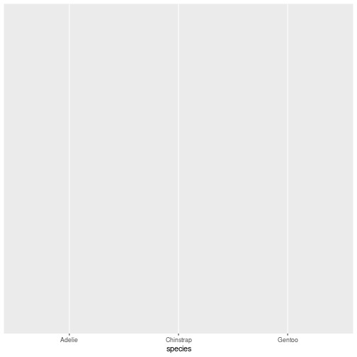
]

---
count: false
 

.panel1-bar-auto[

``` r
penguins_nafree <- penguins %>%  drop_na()
ggplot(penguins_nafree, aes(x = species, fill = sex)) +
  geom_bar(alpha = 0.8, position = "dodge")   #<<
```
]
 
.panel2-bar-auto[
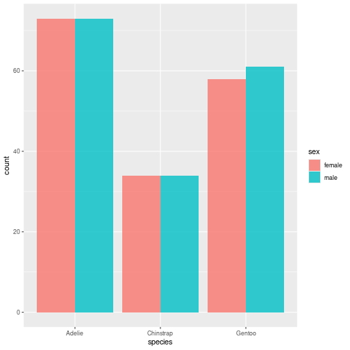
]

---
count: false
 

.panel1-bar-auto[

``` r
penguins_nafree <- penguins %>%  drop_na()
ggplot(penguins_nafree, aes(x = species, fill = sex)) +
  geom_bar(alpha = 0.8, position = "dodge") +
  facet_wrap(~island)   #<<
```
]
 
.panel2-bar-auto[

]

---
count: false
 

.panel1-bar-auto[

``` r
penguins_nafree <- penguins %>%  drop_na()
ggplot(penguins_nafree, aes(x = species, fill = sex)) +
  geom_bar(alpha = 0.8, position = "dodge") +
  facet_wrap(~island) +
  xlab("")   #<<
```
]
 
.panel2-bar-auto[
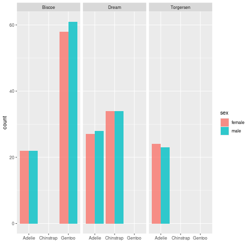
]

---
count: false
 

.panel1-bar-auto[

``` r
penguins_nafree <- penguins %>%  drop_na()
ggplot(penguins_nafree, aes(x = species, fill = sex)) +
  geom_bar(alpha = 0.8, position = "dodge") +
  facet_wrap(~island) +
  xlab("") +
  theme_linedraw()   #<<
```
]
 
.panel2-bar-auto[
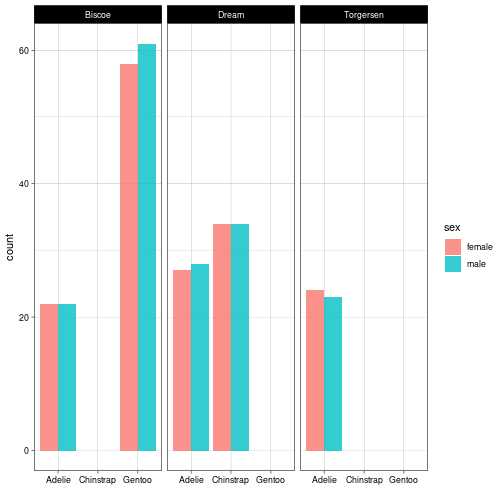
]

---
count: false
 

.panel1-bar-auto[

``` r
penguins_nafree <- penguins %>%  drop_na()
ggplot(penguins_nafree, aes(x = species, fill = sex)) +
  geom_bar(alpha = 0.8, position = "dodge") +
  facet_wrap(~island) +
  xlab("") +
  theme_linedraw() +
  scale_fill_manual(values = c("cyan4","darkorange"), name = "Sex")  #<<
```
]
 
.panel2-bar-auto[
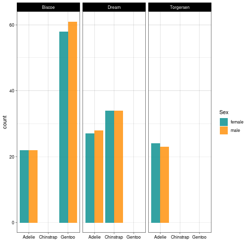
]

<style>
.panel1-bar-auto {
  color: black;
  width: 38.6060606060606%;
  hight: 32%;
  float: left;
  padding-left: 1%;
  font-size: 80%
}
.panel2-bar-auto {
  color: black;
  width: 59.3939393939394%;
  hight: 32%;
  float: left;
  padding-left: 1%;
  font-size: 80%
}
.panel3-bar-auto {
  color: black;
  width: NA%;
  hight: 33%;
  float: left;
  padding-left: 1%;
  font-size: 80%
}
</style>


---


``` r
penguins_nafree <- penguins %>%  drop_na()
ggplot(data = penguins_nafree, aes(x = bill_length_mm, y = bill_depth_mm)) +
  geom_point(aes(color = species),size = 2)  +
  scale_color_manual(values = c("darkorange","darkorchid","cyan4"), name = "") +
  theme_bw() + 
  xlab("Bill length (mm)") +
  ylab("Bill depth (mm)")
```

.footnote[See [Chapter 2](https://biosci220.github.io/BIOSCI220/dealing-with-data.html#data-wrangling-and-manipulation) of the course guide]

---


count: false
 

.panel1-point-auto[

``` r
penguins_nafree <- penguins %>%  drop_na()  #<<
```
]
 
.panel2-point-auto[

]

---
count: false
 

.panel1-point-auto[

``` r
penguins_nafree <- penguins %>%  drop_na()
ggplot(data = penguins_nafree, aes(x = bill_length_mm, y = bill_depth_mm))   #<<
```
]
 
.panel2-point-auto[
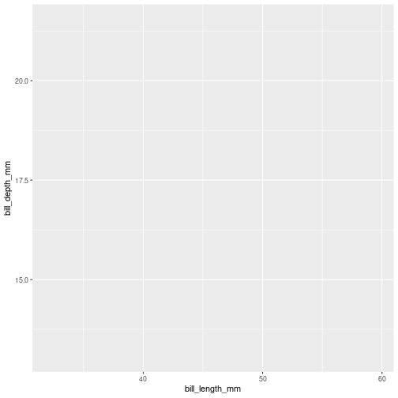
]

---
count: false
 

.panel1-point-auto[

``` r
penguins_nafree <- penguins %>%  drop_na()
ggplot(data = penguins_nafree, aes(x = bill_length_mm, y = bill_depth_mm)) +
  geom_point(aes(color = species),size = 2)    #<<
```
]
 
.panel2-point-auto[
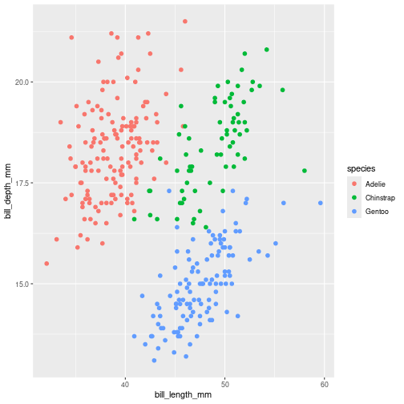
]

---
count: false
 

.panel1-point-auto[

``` r
penguins_nafree <- penguins %>%  drop_na()
ggplot(data = penguins_nafree, aes(x = bill_length_mm, y = bill_depth_mm)) +
  geom_point(aes(color = species),size = 2)  +
  scale_color_manual(values = c("darkorange","darkorchid","cyan4"), name = "")   #<<
```
]
 
.panel2-point-auto[
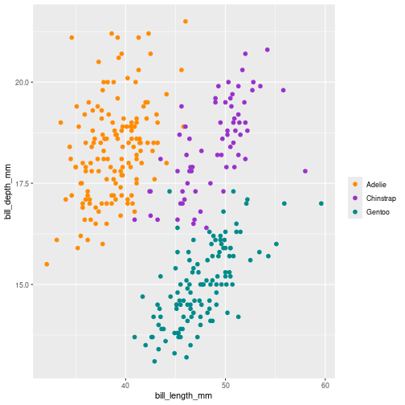
]

---
count: false
 

.panel1-point-auto[

``` r
penguins_nafree <- penguins %>%  drop_na()
ggplot(data = penguins_nafree, aes(x = bill_length_mm, y = bill_depth_mm)) +
  geom_point(aes(color = species),size = 2)  +
  scale_color_manual(values = c("darkorange","darkorchid","cyan4"), name = "") +
  theme_bw()   #<<
```
]
 
.panel2-point-auto[

]

---
count: false
 

.panel1-point-auto[

``` r
penguins_nafree <- penguins %>%  drop_na()
ggplot(data = penguins_nafree, aes(x = bill_length_mm, y = bill_depth_mm)) +
  geom_point(aes(color = species),size = 2)  +
  scale_color_manual(values = c("darkorange","darkorchid","cyan4"), name = "") +
  theme_bw() +
  xlab("Bill length (mm)")   #<<
```
]
 
.panel2-point-auto[
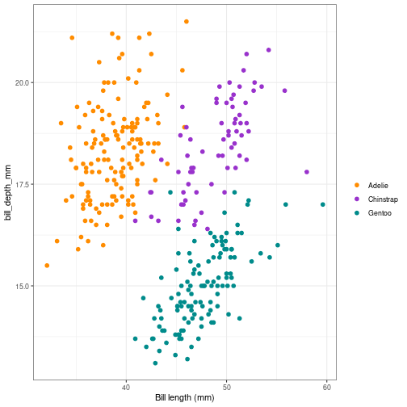
]

---
count: false
 

.panel1-point-auto[

``` r
penguins_nafree <- penguins %>%  drop_na()
ggplot(data = penguins_nafree, aes(x = bill_length_mm, y = bill_depth_mm)) +
  geom_point(aes(color = species),size = 2)  +
  scale_color_manual(values = c("darkorange","darkorchid","cyan4"), name = "") +
  theme_bw() +
  xlab("Bill length (mm)") +
  ylab("Bill depth (mm)")  #<<
```
]
 
.panel2-point-auto[
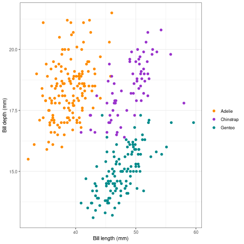
]

<style>
.panel1-point-auto {
  color: black;
  width: 38.6060606060606%;
  hight: 32%;
  float: left;
  padding-left: 1%;
  font-size: 80%
}
.panel2-point-auto {
  color: black;
  width: 59.3939393939394%;
  hight: 32%;
  float: left;
  padding-left: 1%;
  font-size: 80%
}
.panel3-point-auto {
  color: black;
  width: NA%;
  hight: 33%;
  float: left;
  padding-left: 1%;
  font-size: 80%
}
</style>


---


class: inverse, center, middle

[**code along**, live `R` demo]


---
class: inverse, center, middle

### Quiz

<div align=center>
<p><a href="https://dub.sh/biosci220" target="_blank">dub.sh/biosci220</a></p>

</div>

<!--html_preserve--><div class="countdown" id="timer_56821630" data-update-every="1" tabindex="0" style="right:0;bottom:0;">
<div class="countdown-controls"><button class="countdown-bump-down">&minus;</button><button class="countdown-bump-up">&plus;</button></div>
<code class="countdown-time"><span class="countdown-digits minutes">05</span><span class="countdown-digits colon">:</span><span class="countdown-digits seconds">00</span></code>
</div><!--/html_preserve-->

---


### Key points

+ Data visualisation is a **key** aspect of exploration and communication
+ We can **use `ggplot2`** to create informative visualisations in `R`
+ **Creating** a *ggplot* should involve **1)** the `data` object, **2)** a set of `aes`thetic mappings, and **3)** at least one (`geom`) layer.


---
class: inverse, center, middle

###  Week 02, lecture 02

Guest Lecturer: Nicole Edwards


---
class: rolling-slide

###   Week 03, lecture 01

<div class="rolling-container">
  <div class="rolling-content">
  <p>🌼 <strong>Personal support</strong></p>
    <p><a href="https://www.auckland.ac.nz/en/students/student-support/personal-support/te-papa-manaaki-campus-care.html" target="_blank">Te Papa Manaaki | Campus Care</a></p>
    <p>📢 <strong>Admin queries?</strong></p>
    <p> <a href="mailto:jenn.jury@auckland.ac.nz">Email Jenn Jury</a></p>
     <p>📖 <strong>Courseguide</strong></p>
    <p><a href="https://biosci220.github.io/BIOSCI220/" target="_blank">Chapter 4</a></p>
    <p>💬 <strong>My consultation hours</strong></p>
    <p>Mondays & Tuesdays 1—2pm, <a href="https://maps.auckland.ac.nz/wayfinding?type=poi&selectedLocation=1000028551" target="_blank">blg 303 rm 318</a></p>
    <p>💡  <strong>Lecture Activities</strong></p>
    <p><a href="https://dub.sh/biosci220" target="_blank">dub.sh/biosci220</a></p>
    
  </div>
</div>

---

class: inverse

.small[
## Learning Objectives

+ **Identify** the following in a given experiment
      + experimental unit
      + observational units
+ **List** and **describe** the three main principles of experimental design
     + Randomization
     + Replication
     + Blocking
+ **Describe** the layout and set-up of a CRD, RCBD, and a simple factorial experimental design
+ **Discuss** and **critique** a given experimental design
+ **Identify** sources of variation within a given experimental design
]

---
#### **Between group variation**

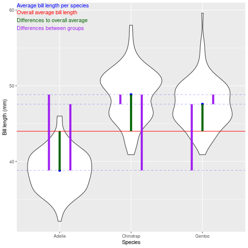


---

#### **Within group variation** 

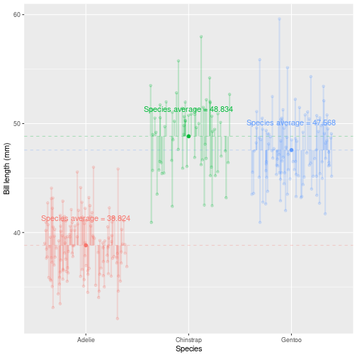


---

###  Key phrases

An **experiment** is a procedure (or set of actions) where a researcher intentionally changes some factor/treatment/variable to observe the effect of their actions. As mentioned above, the collection of observational data is not experimentation.

--

An **experimental unit** is the smallest portion of experimental material which is *independently* perturbed. This is the item under study for which some variable (treatment) is changed. For example this could be a human subject or an agricultural plot.

---


###  Key phrases
 
An **observational unit** (or subsample) is the smallest unit on which a response is measured. 

If the experimental unit is split after the treatment has been applied (e.g., multiple samples taken from one human subject) then this sample is called a subsample or observational unit. If one measurement is made on each experimental unit then the **observational unit** = the **experimental unit**. 

If multiple measurements are made on each subject (e.g., human) then each experimental unit has >1 observational unit. This is then *pseudo-* or *technical replication*.

---

###  Key phrases

A **treatment** (or **independent variable** or **factor** or **treatment factor**) is an experimental condition *independently* applied to an experimental unit. It is one of the variables that is controlled by the researcher during the experiment (e.g., drug type). The values of the treatments within a set are called **levels**. 

---
###  Key phrases

The **dependent variable** or **response** is the output (or thing) that is measured after an experiment. This is what the researcher measures and assesses if changing the treatment(s) (i.e., independent variable(s)) induces any change. 

An **effect** is the change in the response variable caused by the controlled changes in the independent variable. Whether the magnitude of the effect (it's size) is significant (or or any practical interest) is determined by the researcher after carrying out some appropriate analyses.


---
### An example:   


+ Three types of coffee beans are chosen: Arabica , Liberica , and Robusta .
+ 12 identical cups are chosen and sets of four cups are **randomly allocated** one of three treatments.
+ Four sets of each type of coffee beans are ground and cups made (in the same way) resulting in a total of 12 cups of coffee.
+ Samples are taken from each cup and the coffee strength is measured.

---

**Experiment design:**


#### **Scientific question**: Does coffee strength differ between bean types?

---

#### **Scientific question**: Does coffee strength differ between bean types?

There are **3 treatments** (types of coffee beans): Arabica, Liberica, and Robusta.

In this case the **experimental unit** would be the **coffee cup** as each one is allocated a different bean type (treatment).

The **observational unit** changes depending on the scenario (i.e., what and how samples are taken). For example,

   + if a single ml of liquid is taken from each cup and one measurement is taken per ml taken $\rightarrow$ the observational unit would be the **cup**
---


#### Scientific question: Does coffee strength differ between bean types?

There are **3 treatments** (types of coffee beans): Arabica, Liberica, and Robusta.

In this case the **experimental unit** would be the **coffee cup** as each one is allocated a different bean type (treatment).

The **observational unit** changes depending on the scenario (i.e., what and how samples are taken). For example,

   + if a single ml of liquid is taken from each cup and two subsamples are then taken from each ml, then if measurements are taken per subsample $\rightarrow$ then the observational unit would be a **subsample**
   
---

#### Scientific question: Does coffee strength differ between bean types?

There are **3 treatments** (types of coffee beans): Arabica, Liberica, and Robusta.

In this case the **experimental unit** would be the **coffee cup** as each one is allocated a different bean type (treatment).

The **observational unit** changes depending on the scenario (i.e., what and how samples are taken). For example,

   + if four $\times$ 1ml of liquid were taken from each cup and from each ml a measurement is taken $\rightarrow$ then the observational unit would be **each 1ml sample**


---
class: center, middle

### Three (key) principles of exprimental design

.footnote[See [Chapter 4](https://biosci220.github.io/BIOSCI220/introduction-to-the-design-and-analysis-of-experiments.html) of the course guide]

--

### **Replication**

--

### **Randomisation**

--

### **Blocking**


---

**Replication**

.footnote[See [Chapter 4](https://biosci220.github.io/BIOSCI220/introduction-to-the-design-and-analysis-of-experiments.html) of the course guide]

+ **Biological replication:** each treatment is *independently* applied to each of several humans, animals or plants

--

*Why?* To generalize results to population

---

**Replication**

.footnote[See [Chapter 4](https://biosci220.github.io/BIOSCI220/introduction-to-the-design-and-analysis-of-experiments.html) of the course guide]

+ **Technical replication:** two or more samples from the same biological source which are *independently* processed

--

*Why?* 
  + Advantageous if processing steps introduce a lot of variation
  + Increases the precision with which comparisons of relative abundances between treatments are made

---

**Replication**

.footnote[See [Chapter 4](https://biosci220.github.io/BIOSCI220/introduction-to-the-design-and-analysis-of-experiments.html) of the course guide]

+ **Pseudo-replication:** one sample from the same biological source, divided into two or more aliquots which are **independently** measured

--

*Why?* 
  + Advantageous for noisy measuring instruments
  + Increases the **precision** with which comparisons of relative abundances between treatments are made
  
---

**Randomization**

.footnote[See [Chapter 4](https://biosci220.github.io/BIOSCI220/introduction-to-the-design-and-analysis-of-experiments.html) of the course guide]

+ Protects against bias

--

+ Plan the experiment in such a way that the variations caused by extraneous factors can all be combined under the general heading of "chance".


--

+ Ensures that each treatment has the same probability of getting good (or bad) units and thus avoids systematic bias

--

+ Random allocation can cancel out population bias; it ensures that any other possible causes for the experimental results are split equally between groups

---

**Randomisation**

.footnote[See [Chapter 4](https://biosci220.github.io/BIOSCI220/introduction-to-the-design-and-analysis-of-experiments.html) of the course guide]

+ Typically statistical analysis assumes that observations are **independent**. This is almost never strictly true in practice but randomisation means that our estimates will behave as if they were based on independent observations

---

**Blocking**

.footnote[See [Chapter 4](https://biosci220.github.io/BIOSCI220/introduction-to-the-design-and-analysis-of-experiments.html) of the course guide]

+ Blocking helps **control variability** by making treatment groups more alike. Experimental units are divided into subsets (called blocks) so that units within the same block are more similar than units from different subsets or blocks. 

--

+ Blocking is a technique for dealing with *nuisance factors*. A *nuisance factor* is a factor that has some effect on the response, but is of no interest (e.g., age class).

---
### Completely randomised design (CRD)

Let's consider a completely  design with one treatment factor (e.g., coffee bean type). 

--

Here, **n** experimental units (e.g., cups) are divided **randomly** into **t** groups.  Each group is then given one treatment level (one of the treatment factors). As we have defined only one treatment factor all other known independent variables are kept constant so as to not bias any effects.

.footnote[.small[Random allocation can be achieved by simply drawing lots from a hat! To be more rigorous, though, we could use `R`'s `sample()` function.]]

---
### Completely randomised design (CRD)


---
### Randomised complete block design (RCBD)

Let's consider a randomised complete block design with one treatment factor (e.g., coffee bean type). If the treatment factor has **t** levels there will be **b** blocks that each contain **t** experimental units resulting in a total of **t** $\times$ **b** experimental units.  

--

For example, let's imagine that for the coffee experiment we had two cup types: mugs and heatproof glasses. We might consider the type of receptacle to have an effect on the coffee strength measured; however, we are not interested in this. Therefore, to negate this we block by cup type. This means that any effect due to the blocking factor (cup type) is accounted for by the blocking.

---
### Randomised complete block design (RCBD)

For a blocked design we want the **t** experimental units within each block should be as homogeneous as possible (as similar as possible, so that there is unlikely to be unwanted variation coming into the experiment this way). 

--

The variation between blocks (the groups of experimental units) should be large enough (i.e., blocking factors different enough) so that conclusions can be drawn. Allocation of treatments to experimental units is done randomly (i.e., treatments are randomly assigned to units) within each block.

---
### Randomised complete block design (RCBD)


---
class: center, middle, inverse
 
[live demo]

[experiment set-up]

---
### Factorial design (back to slide example)

A factorial experiment is one where there are two or more sets of (factor) treatments. Rather than studying each factor separately all combinations of the treatment factors are considered. 

--

Factorial designs enable us to infer any **interaction** effects, which may be present. An **interaction** effect is one where the effect of one variable depends on the value of another variable (i.e., the effect of one treatment factor on the response variable will change depending on the value of a second treatment factor.)

---

### Factorial design 

For example, we could add another treatment to the coffee experiment: **grinder type** (manual  or electric ). So, now we have two treatments, bean type (with three levels) and grinder type (with two levels). Recall that in a factorial experiment we want to study **all combinations** of the levels of each factor:

---
Now, our **question about the strength of coffee** would be *Does the strength of coffee vary between beans and/or grinder?*

|   | Manual    | Electric   | 
|---|---    |---     |
| Arabica   | A.M   | A.E  |
| Liberica  | L.M   |  L. E |
| Robusta   |  R.M   |  R. E  |

.footnote[Note:  a factorial design has **equal** numbers of replicates in each group then it is said to be a **balanced** design; if this is not the case then it is **unbalanced**.]


---
**Possible outcomes**

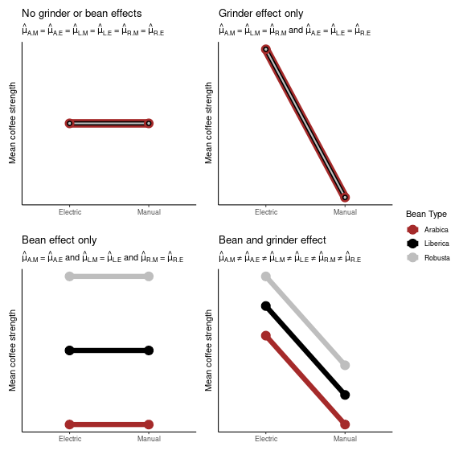

---

If an **interaction** effect exists the effect of one factor on the response will change depending on the level of the other factor:

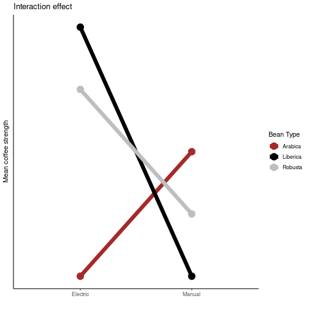


---

### Key points

+ An **experimental unit** is the item under study for which some treatment is changed
+ An **observational unit** is the smallest unit on which a response is measured
+ **Replication** (helps us generalise results), **Randomisation** (helps protect against bias), and **Blocking** (helps account for some factor we're not interested in) are key when designing experiments

---

---
class: rolling-slide

###   Week 03, lecture 02

<div class="rolling-container">
  <div class="rolling-content">
  <p>🌼 <strong>Personal support</strong></p>
    <p><a href="https://www.auckland.ac.nz/en/students/student-support/personal-support/te-papa-manaaki-campus-care.html" target="_blank">Te Papa Manaaki | Campus Care</a></p>
    <p>📢 <strong>Admin queries?</strong></p>
    <p> <a href="mailto:jenn.jury@auckland.ac.nz">Email Jenn Jury</a></p>
     <p>📖 <strong>Courseguide</strong></p>
    <p><a href="https://biosci220.github.io/BIOSCI220/" target="_blank">Chapter 5</a></p>
    <p>💬 <strong>My consultation hours</strong></p>
    <p>Mondays & Tuesdays 1—2pm, <a href="https://maps.auckland.ac.nz/wayfinding?type=poi&selectedLocation=1000028551" target="_blank">blg 303 rm 318</a></p>
    <p>💡  <strong>Lecture Activities</strong></p>
    <p><a href="https://dub.sh/biosci220" target="_blank">dub.sh/biosci220</a></p>
    
  </div>
</div>

---
.small[
### Learning objectives

+ **Formulate** a question/hypothesis to investigate based on the given data
+ **List** the aims, **write** out the appropriate null and alternative hypothesis using statistical notation for, and write `R` code to carry out a randomisation test
+ **Correctly interpret** and **communicate** a p-value in terms of a randomisation test
]

---
#### What can you say about this plot?

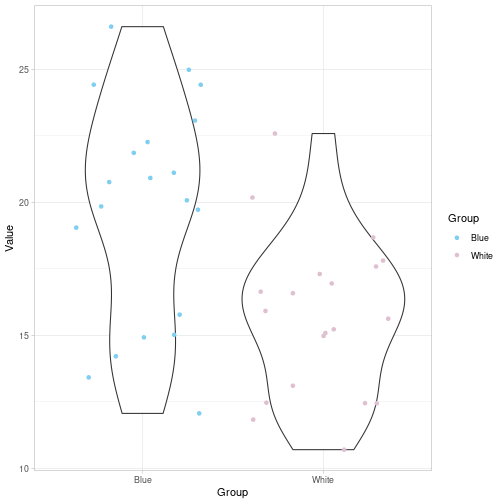
---
##### Do you think the mean of each group are significantly different from each other? Why or why not? 

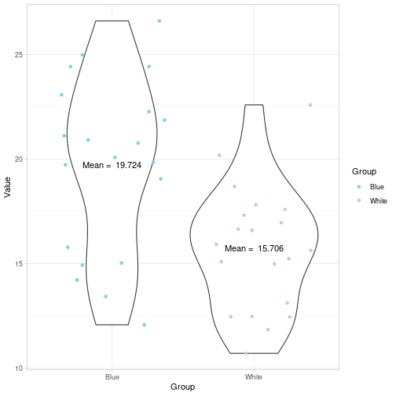

---
### Difference in means for our observed data


``` r
## read in csv
## can download from CANVAS after lecture
data <- readr::read_csv("randomisation_data.csv")
```


``` r
## observed data 
glimpse(data)
```

```
## Rows: 40
## Columns: 2
## $ Group <chr> "Blue", "Blue", "Blue", "Blue", "Blue", "Blue", "Blue", "Blue", "Blue", "Blue", "Blue", "Blue", "Blue", "Blue", "Blue", "Blue", "Blue", "Blue", "Blue", "Blue", "White", "White", "White", "…
## $ Value <dbl> 23.06963, 24.41810, 20.07219, 24.42020, 14.92100, 19.72031, 15.77376, 26.60280, 22.26419, 15.01948, 19.04657, 13.41574, 19.84524, 20.91369, 20.76054, 24.98020, 14.20866, 12.06299, 21.85749…
```

---
### Difference in means for our observed data


``` r
diff_in_means <- data %>% 
  group_by(Group) %>% 
  summarise(mean = mean(Value)) %>%
  summarise(diff = diff(mean)) %>% as.numeric()
diff_in_means
```

```
## [1] -4.018622
```

---
class: center, middle, inverse

### [**Demo**]

---
**Randomisation test**


 + **Decide** on a metric to measure the effect in question (e.g., differences between group medians)
 
--
 
 + **Calculate** that test statistic on the observed data. Note this metric can be **anything** you wish
 
--

 + For chosen number of times (*bigger the better*)
    + **Shuffle** the data labels
    + **Calculate** the test statistic for the reshuffled data and retain
  
---
**Randomisation test**

 + **Calculate** the proportion of times your reshuffled statistics equal or exceed the observed
    + typically here we use the absolute values as we'd be carrying out a **two-tailed** test (or we could double the p-value)
    + this is the probability of such an extreme result under the null
    
--

 + **State** the strength of evidence against the null on the basis of this **probability**.


---

[cheatsheet link](https://github.com/BIOSCI738/cowstats/blob/main/img/randomisation.png?raw=true)


